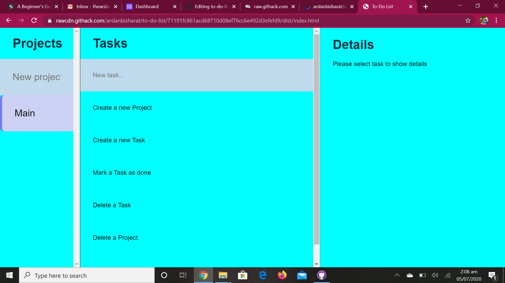

# TODO LIST

This is the 4th project of the Main Javascript curriculum at [Microverse](https://www.microverse.org/) - @microverseinc

* The objective is to build a page with interactivity using everything learn about **Objects**, **Factory Functions**, The **Module Pattern**
* The project was completed using Javascript language.

#### [Assignment link](https://www.theodinproject.com/courses/javascript/lessons/todo-list)

## Live Link
[Click Here](https://rawcdn.githack.com/arslanbisharat/to-do-list/71191fc861acd68710d08ef76cc6e492d3efefd9/dist/index.html)

## Built With

- HTML5
- CSS
- JavaScript

## Authors
**Arslan Bisharat**

- Github: [@githubhandle](https://github.com/arslanbisharat)
- Twitter: [@twitterhandle](https://twitter.com/arslan_bisharat-2020bb156)
- Linkedin: [linkedin](https://www.linkedin.com/in/muhammad-arslan-2020bb156)

## 🤝 Contributing

Contributions, issues and feature requests are welcome!

Feel free to check the [issues page](https://github.com/arslanbisharat/to-do-list/issues).

## Show your support

Give a ⭐️ if you like this project!
